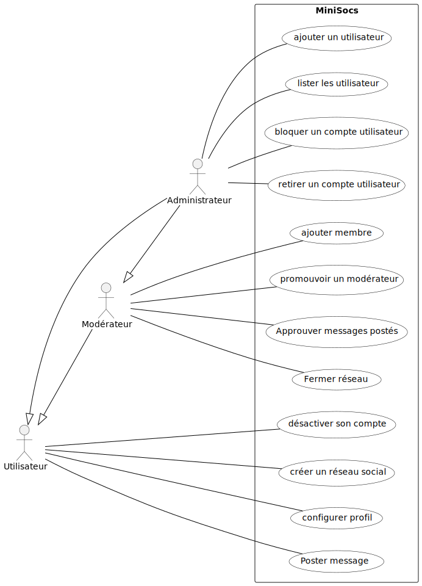
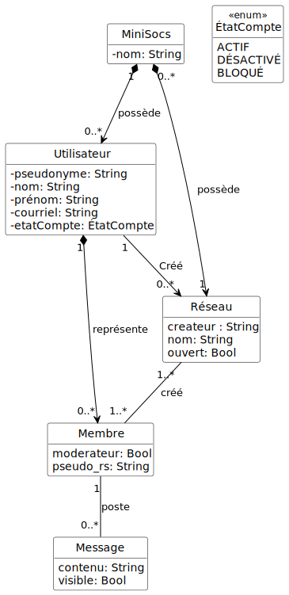
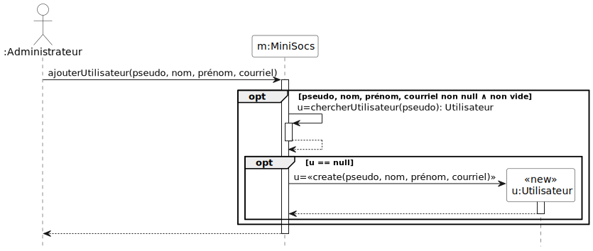
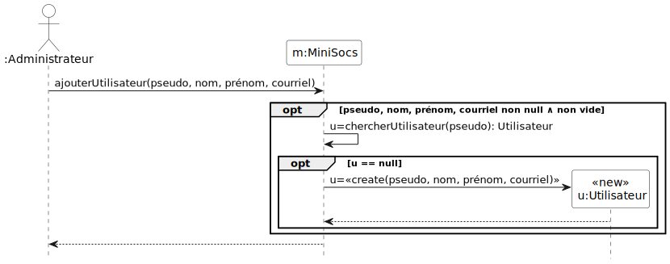
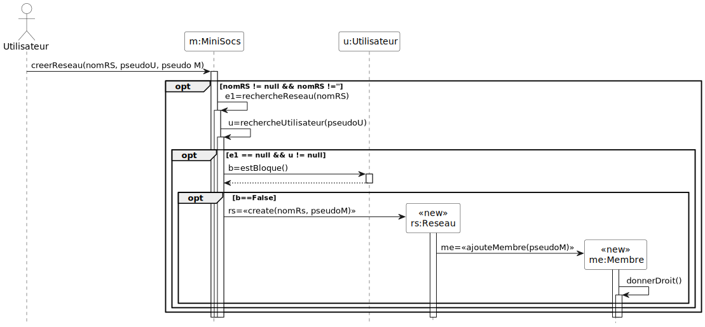

# Gestion de mini réseaux sociaux MiniSocs

Binôme :
* Hugo Cadet
* Alex Aïdan

## Syntaxe MarkDown

La syntaxe MarkDown de ce document est compatible avec la syntaxe
GitLab, qui est documentée dans
https://docs.gitlab.com/ee/user/markdown.html

## 1. Spécification

### 1.1. Acteurs et cas d'utilisation

La **première étape** consiste à **bien comprendre le système** à
étudier. Dans le cadre de l'exercice, cela consiste à lire
attentivement l'énoncé. Cette lecture doit permettre de *délimiter les
contours du système* à réaliser. La méthode générale consiste à
retrouver les acteurs qui interagissent avec lui. Il est très
important de fixer des frontières au problème. Ensuite, nous
recherchons les fonctionnalités du système par la définition de ses
cas d'utilisation. Dans le cadre de ce module, il s'agit de rechercher
les principales fonctions attendues du système. Nous nous limitons aux
cas d'utilisation pour atteindre les premiers objectifs indiqués dans
le cahier des charges, en prenant en considération les simplifications
énoncées dans le cahier des charges.

Pour réaliser le diagramme de cas d'utilisation à partir de l'analyse
du texte :
* rechercher les acteurs, avec les potentielles relation de
  généralisation spécialisation,
* rechercher les fonctionnalités du système accessibles aux acteurs

Pour rappel, la documentation du langage pour écrire les diagrammes
UML avec PlantUML est disponible à l'adress suivante :
- (https://plantuml.com/fr/)

Voici ci-dessous le diagramme de cas d'utilisation avec les cas
d'utilisation les plus importants (code
[source](./Diagrammes/minisocs_uml_diag_cas_utilisation.pu)).



ajouter diagrammes pdf 

### 1.2. Priorités, préconditions et postconditions des cas d'utilisation

Les priorités des cas d'utilisation sont choisies avec les règles de
bon sens suivantes:

* pour retirer une entité du système, elle doit y être. La priorité de
l'ajout est donc supérieure ou égale à la priorité du retrait ;

* pour lister les entités d'un type donné, elles doivent y être. La
priorité de l'ajout est donc supérieure ou égale à la priorité du
listage ;

* il est *a priori* possible, c.-à-d. sans raison contraire, de
démontrer la mise en œuvre d'un sous-ensemble des fonctionnalités du
système, et plus particulièrement la prise en compte des principales
règles de gestion, sans les retraits ou les listages ;

* la possibilité de lister aide au déverminage de l'application
pendant les activités d'exécution des tests de validation.

Par conséquent, les cas d'utilisation d'ajout sont *a priori* de
priorité « HAUTE », ceux de listage de priorité « Moyenne», et ceux de
retrait de priorité « basse ».

Voici les précondition et postcondition des cas d'utilisation de
priorité HAUTE.

#### Ajouter un utilisateur (HAUTE)
- précondition : \
∧ pseudo bien formé (non null ∧ non vide) \
∧ nom bien formé  (non null ∧ non vide) \
∧ prénom bien formé  (non null ∧ non vide) \
∧ courriel bien formé (respectant le standard RFC822) \
∧ utilisateur avec ce pseudo inexistant
- postcondition : \
∧ utilisateur avec ce pseudo existant \
∧ le compte de l'utilisateur est actif

#### Désactiver son compte (HAUTE)
- précondition : \
∧ pseudo bien formé (non null ∧ non vide) \
∧ le compte n'est pas bloqué \
∧ utilisateur avec ce pseudo existant
- postcondition : le compte de l'utilisateur est désactivé

NB : l'opération est idempotente.

#### Poster un message (HAUTE)
- précondition : \
∧ message bien formé (non null ∧ non vide)  \
∧ le membre correspond a un utilisateur actif \
∧ le membre fait parti du réseau \
- postcondition : \
∧ Message soumis au processus de modération suite à une notification au modérateur ∨ directement visible si le membre est lui même modérateur

 
 
#### Créer un réseau social (HAUTE)
- précondition : \
∧ nom du réseau, pseudoMembre, pseudoUtilisateur bien formé (non null ∧ non vide)  \
∧ l'utilisateur existe et n'est pas bloqué ∧ \
∧ le nom du réseau n'est pas déjà utilisé \
- postcondition : 
∧ Le réseau social est créé 
∧ utilisateur promu modérateur 


#### Ajouter une membre à un réseau social (HAUTE)
- précondition : \
∧ pseudo bien formé (non null ∧ non vide) \
∧ le compte n'est pas bloqué \
∧ le réseau existe
∧ le membre qui ajoute à les droits (modérateur ∧ non bloqué)
∧ choix du système de notification correct (immédiate ∨ quotidienne ∨ sans notification)
- postcondition : membre ajouté au r.s.

#### Modérer un message (HAUTE)
- précondition : \
∧ message existe et est bien formé (non null ∧ non vide) \
∧ le reseau du message existe et est similaire à celui du membre \
∧ le membre existe et est modérateur \
∧ message non encore visible \
- postcondition : \
∧ message visible \

#### Autres cas d'utilisation et leur priorité respective

- Retirer un utilisateur (basse)

- Bloquer le compte d'un utilisateur (basse)

- Lister les utilisateurs (moyenne)

- Lister les réseaux sociaux (moyenne)

- configurer profil (moyenne)

- Promotion modérateur (moyenne)

- Fermer réseau social (basse)


## 2. Préparation des tests de validation des cas d'utilisation

#### Ajouter un utilisateur (HAUTE)

|                                                     | 1 | 2 | 3 | 4 | 5 | 6 |
|:----------------------------------------------------|:--|:--|:--|---|---|---|
| pseudo bien formé (non null ∧ non vide)             | F | T | T | T | T | T |
| nom bien formé  (non null ∧ non vide)               |   | F | T | T | T | T |
| prénom bien formé  (non null ∧ non vide)            |   |   | F | T | T | T |
| courriel bien formé (respectant le standard RFC822) |   |   |   | F | T | T |
| utilisateur avec ce pseudo inexistant               |   |   |   |   | F | T |
|                                                     |   |   |   |   |   |   |
| utilisateur avec ce pseudo existant                 | F | F | F | F | F | T |
| compte de l'utilisateur actif                       | F | F | F | F | F | T |
|                                                     |   |   |   |   |   |   |
| nombre de tests dans le jeu de tests                | 2 | 2 | 2 | 3 | 1 | 1 |

Le jeu de test 4 comporte trois tests : non null, non vide, et adresse
courriel bien formée. On aurait pu n'en faire qu'un en considérant la
bibliothèque de validation RFC822 vérifie les deux premières
conditions.

#### Désactiver son compte (HAUTE)

|                                          | 1 | 2 | 3 | 4 |
|:-----------------------------------------|:--|:--|:--|:--|
| pseudo bien formé (non null ∧ non vide)  | F | T | T | T |
| le compte n'est pas bloqué               |   | F | T | T |
| utilisateur avec ce pseudo existant      |   |   | F | T |
|                                          |   |   |   |   |
| le compte de l'utilisateur est désactivé | F | F | F | T |
|                                          |   |   |   |   |
| nombre de tests dans le jeu de tests     | 2 | 1 | 1 | 1 |


#### Créer un réseau social (HAUTE)

|                                                     | 1 | 2 | 3 | 4 | 5 |
|:----------------------------------------------------|:--|:--|:--|---|---|
| nom du réseau bien formé (non null ∧ non vide)      | F | T | T | T | T |
| Le réseau n'existe pas déjà                         |   | F | T | T | T |
| le compte existe                                    |   |   | F | T | T |
| le membre qui le créé non bloqué                    |   |   |   | F | T |
|                                                     |   |   |   |   |   |
| Réseau créé                                         | F | F | F | F | T |
| User promu modérateur                               | F | F | F | F | T |
|                                                     |   |   |   |   |   |
| nombre de tests dans le jeu de tests                | 2 | 1 | 1 | 1 | 1 |


#### Poster un message (HAUTE)

|                                                                | 1 | 2 | 3 | 4 | 5 |
|:---------------------------------------------------------------|:--|:--|:--|---|---|
| Message bien formé (respectant le standard RFC822 ∧ non vide)  | F | T | T | T | T |
| L’user n’est pas bloqué                                        |   | F | T | T | T |
| L'user fait parti du réseau                                    |   |   | F | T | T |
|                                                                |   |   |   |   |   |
| Message soumis au processus de modération suite à              |   |   |   |   |   |
| une notification au modérateur ∨                               | F | F | F | F | T |
| directement visible si l'user est                              |   |   |   |   |   |
| lui même modérateur                                            |   |   |   |   |   |
|                                                                |   |   |   |   |   |
| nombre de tests dans le jeu de tests                           | 1 | 1 | 1 | 1 | 1 |

#### Ajouter un membre à un réseau social (HAUTE)

|                                                     | 1 | 2 | 3 | 4 | 5 | 6 | 7 |
|:----------------------------------------------------|:--|:--|:--|---|---|---|---|
| pseudo bien formé (non null ∧ non vide)             | F | T | T | T | T | T | T |
| le compte n'est pas bloqué                          |   | F | T | T | T | T | T |
| le réseau existe                                    |   |   | F | T | T | T | T |
| le membre qui ajoute à les droits                   |   |   |   | F | T | T | T |
| choix du système de notification correct            |   |   |   |   | F | T | T |
|                                                     |   |   |   |   |   | F | T |
| membre ajouté au r.s                                | F | F | F | F | F | T | T |
|                                                     |   |   |   |   |   |   |   |
| nombre de tests dans le jeu de tests                | 2 | 2 | 2 | 1 | 1 | 1 | 1 |

#### Ajouter un utilisateur (HAUTE)

|                                                     | 1 | 2 | 3 | 4 | 5 |
|:----------------------------------------------------|:--|:--|:--|---|---|
| message existe et bien formé (non null ∧ non vide)  | F | T | T | T | T |
| reseau du message existe et est cohérent avec membre|   | F | T | T | T | 
| membre est modérateur 			           	      |   |   | F | T | T |
| message non visible 					              |   |   |   | F | T |
|                                                     |   |   |   |   |   |
| message visible                                     | F | F | F | F | T |
|                                                     |   |   |   |   |   |
| nombre de tests dans le jeu de tests                | 3 | 2 | 1 | 1 | 1 |


# 3. Conception

## 3.1. Listes des classes candidates et de leurs attributs

Voici les listes des classes candidates et de leurs attributs:
- `MiniSocs` (mise en œuvre du patron de conception Façade) avec
  l'attribut `nom` pour le nom du système,
- `Utilisateur` avec les attributs `pseudo` pour identifier de manière
  unique un utilisateur, `nom` et `prénom`, adresse `courriel`, et
  `etatCompte` pour l'état de son compte,
- `ÉtatCompte` avec les énumérateurs `COMPTE_ACTIF` et `COMPTE_DÉSACTIVÉ`,

## 3.2. Premières opérations des classes

Les seules opérations que nous connaissons déjà sont celles
correspondant aux cas d'utilisation. Comme nous utilisons le patron de
conception Façade, toutes les opérations des cas d'utilisation sont
dans la Façade.

Donc, dans la classe `MiniSocs`, voici les premières opérations (en
ignorant celles de priorité « basse ») :
- `ajouterUtilisateur`,
- `désactiverCompte`,
- `bloquerCompte`,
- `listerUtilisateurs`.

## 3.3. Diagramme de classes

Le diagramme de classes obtenu lors d'une analyse à partir de l'énoncé
du problème est donné dans la figure qui suit. Dans ces diagrammes,
les opérations ne sont pas mentionnées parce qu'il y en aurait trop.

**Important: même dans les diagrammes de la conception détaillée, on
ne montre pas les attributs traduisant des associations.**

Pour rappel, la documentation du langage pour écrire les diagrammes
UML avec PlantUML est disponible à l'adress suivante :
- (https://plantuml.com/fr/)

Version sans les notifications
([source](./Diagrammes/minisocs_uml_diag_classes_sans_notif.pu)).



## 3.4. Diagrammes de séquence

Dans la suite, plusieurs versions d'un même diagramme de séquence sont proposés :
- une version dite « recommandée » **avec** les barres d'activation,
- une version dite « simplifiée » **sans** les barres d'activation.

Pour rappel, la documentation du langage pour écrire les diagrammes
UML avec PlantUML est disponible à l'adress suivante :
- (https://plantuml.com/fr/)

#### Ajouter un utilisateur (HAUTE)

Version recommandée
([source](./Diagrammes/minisocs_uml_diag_seq_ajouter_utilisateur.pu)).



Version simplifiée
([source](./Diagrammes/minisocs_uml_diag_seq_ajouter_utilisateur_version_simplifiee.pu)).



#### Créer un nouveau réseau
([source](./Diagrammes/minisocs_uml_diag_creer_reseau.pu)).



#### Poster un message
([source](./Diagrammes/minisocs_uml_diag_poster_mess.pu)).


# 7. Diagrammes de machine à états et invariants

Dans les diagrammes de machine à états, nous faisons le choix de faire
apparaître les états de création et de destruction. Ces états sont
transitoires, il est vrai, mais ils méritent cependant une attention
particulière.  L'état de création, en particulier, donne lieu, lors de
la réalisation dans un langage de programmation orienté objet, à
l'écriture d'une opération « constructeur » qui garantit que
tous les attributs sont initialisés correctement dès la création d'une
instance. Nous savons également qu'en Java la destruction se réalise
en « oubliant » l'objet : un mécanisme de ramasse
miettes détruit automatiquement les objets lorsqu'ils ne sont plus
référencés. Il n'en est pas de même dans tous les langages, et par
exemple en C++ qui ne possède pas de mécanisme de ramasse miettes, la
destruction des objets peut s'avérer un casse tête ardu.

Les actions provoquées par des appels en provenance d'autres objets
apparaissent sur les transitions. Nous avons gardé comme action
interne uniquement les actions correspondant à des appels que l'objet
fait seul ou fait de manière répétitive.  Les constructeurs et
destructeurs sont des exceptions (ils apparaissent en interne bien
qu'étant déclenchés par un autre objet).

## 7.1. Classe Utilisateur

### 7.1.1. Diagramme de machine à états

Diagramme ([source](./Diagrammes/minisocs_uml_diag_machine_a_etats_utilisateur.pu)).


### 7.1.2. Fiche de la classe

Voici tous les attributs de la classe :
```
— final String pseudonyme
— String nom
— String prenom
— String courriel
— EtatCompte etatCompte
```

### 7.1.3. Invariant

```
  pseudonyme != null ∧ !pseudonyme.isBlank()
∧ nom != null ∧ !nom.isBlank()
∧ prenom != null ∧ !prenom.isBlank()
∧ EmailValidator.getInstance().isValid(courriel)
∧ etatCompte != null
```
EtatMessage = EnAttente V valide V non valide 
# 8 Préparation des tests unitaires

## 8.1. Opérations de la classe Utilisateur

### Opération constructeur

|                                              | 1   | 2   | 3   | 4   | 5   |
|:---------------------------------------------|:----|:----|:----|:----|:----|
| pseudonyme bien formé (non null ∧ non vide)  | F   | T   | T   | T   | T   |
| nom bien formé (non null ∧ non vide)         |     | F   | T   | T   | T   |
| prénom bien formé  (non null ∧ non vide)     |     |     | F   | T   | T   |
| courriel bien formé selon le standard RFC822 |     |     |     | F   | T   |
|                                              |     |     |     |     |     |
| pseudonyme' = pseudonyme                     | F   | F   | F   | F   | T   |
| nom' = nom                                   | F   | F   | F   | F   | T   |
| prénom' = prénom                             | F   | F   | F   | F   | T   |
| courriel' = courriel                         | F   | F   | F   | F   | T   |
| étatCompte' = actif                          | F   | F   | F   | F   | T   |
|                                              |     |     |     |     |     |
| levée d'un exception                         | oui | oui | oui | oui | non |
|                                              |     |     |     |     |     |
| nombre de tests dans le jeu de tests         | 2   | 2   | 2   | 3   | 1   |

Trois tests dans le jeu de tests 5 pour non null, puis non vide, et
enfin une chaîne de caractères qui n'est pas une adresse courriel.

### Opération désactiverCompte

|                                      | 1   | 2   |
|:-------------------------------------|:----|:----|
| étatCompte = actif                   | F   | T   |
|                                      |     |     |
| étatCompte' = désactivé              |     | T   |
|                                      |     |     |
| levée d'une exception                | oui | non |
|                                      |     |     |
| nombre de tests dans le jeu de tests | 1   | 2   |

Deux tests dans le jeu de tests 2 pour l'idempotence.

## 8.2. Opérations de la classe Message

### Opération constructeur

|                                              | 1   | 2   | 3   | 4   | 5   |
|:---------------------------------------------|:----|:----|:----|:----|:----|
| Contenu bien formé (non vide)                |  F  |  T  | T   | T   | T   |
| Date publication bien formée (non vide)      |     |  F  | T   | T   | T   |
| Statut bien défini (non vide)                |     |     | F   | T   | T   |
|                                              |     |     |     |     |     |
| contenu' = contenu                           | F   | F   | F   | F   | T   |
| datePublication' = datePublication           | F   | F   | F   | F   | T   |
| statu' = statu                               | F   | F   | F   | F   | T   |
|                                              |     |     |     |     |     |
| levée d'un exception                         | oui | oui | oui | non | non |
|                                              |     |     |     |     |     |
| nombre de tests dans le jeu de tests         | 1   | 1   | 1   | 1   | 1   |

### Opération moderer()

|                                                 | 1   | 2   |
|:------------------------------------------------|:----|:----|
| statut intial du message (message modéré ou non)| F   | T   |
|                                                 |     |     |
| staut après la modération                       | F   | T   |
|                                                 |     |     |
| levée d'une exception (si nécessaure)           | oui | non |
|                                                 |     |     |
| nombre de tests dans le jeu de tests            | 1   | 1   |


---
FIN DU DOCUMENT
